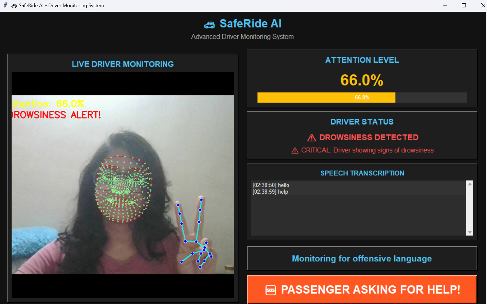
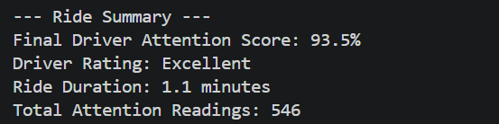

# 🚗 SafeRide_AI: Driver Safety Monitoring System

## 📖 Overview

SafeRide_AI is an AI-powered safety system for ride-hailing services like Ola and Uber. It uses YOLO-based computer vision to monitor driver attention, drowsiness levels, phone usage, and speech-to-text analysis to detect offensive or unsafe language, ensuring passenger safety in real-time.

It is a **hybrid computer vision and audio processing system** that uses your dashcam to track a driver's behaviour in real-time. It combines **YOLOv8** for object detection with **MediaPipe** for face and eye analysis to provide comprehensive driver monitoring.

The system outputs a continuous **attention score (0–100)** that reflects how focused the driver is, adjusting dynamically based on various behavioral indicators. At the end of each ride, it calculates an **average attention score** to provide a **final driver rating** that can help passengers make informed decisions about driver selection.

## ✨ Features

### Video Monitoring
- **Driver Attention Tracking**: Monitors driver's focus level using facial landmark detection
- **Drowsiness Detection**: Detects signs of drowsiness through eye closure tracking
- **Phone Usage Detection**: Identifies when driver is using a mobile phone
- **Yawning Detection**: Detects excessive yawning as a sign of fatigue
- **Fidgeting Detection**: Monitors hand movements near face as a distraction indicator

### Audio Monitoring
- **Speech-to-Text Transcription**: Real-time transcription of driver's speech
- **Offensive Language Detection**: Identifies and flags offensive or unsafe language
- **Emergency Alert System**: Sends alerts when dangerous language is detected
- **Passenger Help Detection**: Detects when passengers ask for help using specific phrases
- **Offensive Words Logging**: Automatically logs offensive language for reporting to ride-hailing companies

### Ride Performance Analysis
- **Continuous Attention Scoring**: Real-time attention score (0-100%) throughout the ride
- **Final Driver Rating**: Average attention score calculated at the end of the ride
- **Performance Report**: Detailed driver performance report with rating and statistics
- **Ride Statistics**: Duration, attention readings count, and performance metrics

## 🔄 System Workflow

1. **Frame Capture**: Captures live webcam feed using OpenCV
2. **YOLOv8 Object Detection**: Detects distractive objects (phones, books, laptops, etc.)
3. **Face Detection & Landmark Extraction**: Uses MediaPipe FaceMesh for EAR and MAR calculations
4. **Hand Detection & Fidget Tracking**: Detects hand-to-face contact using MediaPipe Hands
5. **Temporal Smoothing**: Uses moving average to stabilize score fluctuations
6. **Scoring & Display**: Generates attention score and visual alerts

## 🧰 Technologies Used

| Component | Library/Tool | Role |
|----------|--------------|------|
| Webcam Feed | OpenCV | Frame capture & visualization |
| Object Detection | YOLOv8 (`ultralytics`) | Detect phones, books, laptops |
| Face & Eyes | MediaPipe FaceMesh | EAR/MAR calculation & orientation |
| Hands | MediaPipe Hands | Detects hand-to-face (fidgeting) |
| Audio Processing | SpeechRecognition | Speech-to-text conversion |
| Scoring Logic | Python/NumPy | Calculates weighted attention score |
| Visualization | OpenCV | Draws UI overlays and score display |
| GUI | Tkinter | Dashboard for monitoring metrics |

## 🛠️ Installation

### 1. Create Virtual Environment (Recommended)
```bash
# Using conda
conda create -n saferide_ai python=3.9 -y
conda activate saferide_ai

# Or using venv
python -m venv saferide_ai
source saferide_ai/Scripts/activate
```

### 2. Install Dependencies
```bash
pip install -r requirements.txt
```

### 3. Download YOLOv8 Model
The YOLOv8 model (yolov8n.pt) will be automatically downloaded by Ultralytics on first run, or you can manually download it.

## 🚀 Usage

Run the main application:
```bash
python src/main.py
```

## 🎮 Controls

- **ESC** → Quit the application

## 🧠 How It Works

### Attention Detection
- Uses MediaPipe FaceMesh to track facial landmarks
- Calculates Eye Aspect Ratio (EAR) to detect eye closure and drowsiness
- Analyzes gaze direction to determine if the driver is looking at the road
- Detects objects in the scene that may cause distractions (phones, books, laptops)
- Monitors hand movements for fidgeting behavior
- Implements Mouth Aspect Ratio (MAR) to detect yawning

### Drowsiness Detection
- Tracks eye closure over time using EAR
- Detects sustained eye closure (>1 second) for drowsiness alerts
- Provides early warning for brief eye closures (>0.25 seconds)
- Implements yawning detection as another fatigue indicator

### Phone Usage Detection
- Detects phones using YOLOv8 object detection
- Tracks hand position relative to detected phone
- Provides persistent "ON CALL" alert when phone is detected

### Speech Recognition
- Transcribes spoken words in real-time using Google's Speech-to-Text API
- Detects offensive or dangerous language through pattern matching
- Sends webhook alerts when inappropriate speech is detected
- Logs offensive words for reporting to ride-hailing companies (Ola/Uber)
- **Passenger Help Detection**: Identifies when passengers request help using specific phrases like "help", "police", "stop the car", etc.

### Help Phrases Detected

**help, police, stop the car, stop car, emergency, danger, call police, get help, need help, help me, pull over, stop the vehicle, emergency stop, dangerous, unsafe, scared, afraid, threat, assault, harassment**

## 📊 Real-Time Attention Scoring (Out of 100)

| Factor | Weight/Penalty | Condition |
|--------|----------------|-----------|
| Face detected | +25 | Visible in frame |
| Eyes open | +25 | EAR > threshold |
| Looking at screen | +20 | Proper gaze direction |
| No distractions | +25 | No phone/book/laptop |
| Phone detected | -35 | YOLO detects phone |
| Book/laptop detected | -20/-25 | YOLO detects objects |
| Hand near face | -15 | Fidgeting detected |
| Phone usage | -30 | Hand on phone |
| Yawning | -25 | Sustained mouth opening |
| Drowsy | -40 | Eyes closed ≥1s |
| Eyes closing | -20 | Eyes closed ≥0.25s |

Final score = max(0, min(100, weighted sum))

## 📊 Driver Performance Rating System

At the end of each ride, SafeRide_AI calculates a final driver performance score based on the average attention level throughout the journey. This score helps passengers make informed decisions about driver selection and provides valuable feedback to ride-hailing companies.

### How It Works

1. **Continuous Monitoring**: The system tracks attention levels throughout the entire ride
2. **Data Collection**: All attention scores are stored and timestamped
3. **Offensive Language Detection**: The system monitors for offensive language and applies penalties
4. **Average Calculation**: When the ride ends, an average score is computed with penalties applied
5. **Rating Assignment**: Drivers receive a rating based on their adjusted score
6. **Performance Report**: A detailed report is generated with statistics and metrics

### Rating Scale

| Score Range | Rating        | Description |
|-------------|---------------|-------------|
| 90-100%     | Excellent     | Outstanding attention and focus throughout the ride |
| 80-89%      | Very Good     | Very good attention levels with minimal distractions |
| 70-79%      | Good          | Good attention overall with occasional lapses |
| 60-69%      | Average       | Average attention with moderate focus |
| 50-59%      | Below Average | Below average attention with noticeable distractions |
| 0-49%       | Poor          | Poor attention levels with significant distractions |

### Performance Penalties

The system applies penalties to the final score for inappropriate behavior:

| Infraction | Penalty | Maximum Penalty |
|------------|---------|-----------------|
| Offensive Language | -5 points per incident | -30 points total |

### Performance Report Details

The final performance report includes:
- **Final Attention Score**: Average of all attention readings during the ride (adjusted for penalties)
- **Driver Rating**: Categorical rating based on the adjusted score
- **Ride Duration**: Total time of the monitored ride
- **Attention Readings**: Number of attention level measurements taken
- **Offensive Language Incidents**: Count of detected offensive language instances
- **Performance Description**: Detailed explanation of the rating and any penalties applied

This system provides an objective measure of driver attentiveness that can be used by passengers to select drivers and by ride-hailing companies to monitor driver performance.



## 🔄 Model Retraining for Improving Accuracy

To improve the accuracy of object detection (phones, books, laptops), you can retrain the YOLOv8 model with custom data:

### 1. Setup Training Environment
```bash
# Install additional dependencies for training
pip install torch torchvision

# Setup dataset structure
python src/train_model.py --action setup
```

### 2. Prepare Your Custom Dataset
- Organize images in the `datasets/custom_dataset/images/` directory
- Create corresponding label files in YOLO format in `datasets/custom_dataset/labels/`
- Split data into train and validation sets (80/20 ratio recommended)

### 3. Train the Model
```bash
# Basic training with default parameters
python src/train_model.py --action train

# Advanced training with custom parameters
python src/train_model.py --action train --model_size s --epochs 150 --batch_size 32 --img_size 640
```

### 4. Validate the Trained Model
```bash
python src/train_model.py --action validate
```

### 5. Update the System to Use the New Model
```bash
python src/train_model.py --action update --new_model_path path/to/your/best.pt
```

### Training Parameters

| Parameter | Description | Recommended Value |
|----------|-------------|-------------------|
| `model_size` | Model size (n, s, m, l, x) | `s` for balance of speed/accuracy |
| `epochs` | Number of training iterations | 100-300 |
| `batch_size` | Images per batch | 16-64 (based on GPU memory) |
| `img_size` | Input image size | 640 |

### Tips for Better Accuracy

1. **Dataset Quality**: Use high-quality, diverse images with various lighting conditions
2. **Annotation Accuracy**: Ensure precise bounding box annotations
3. **Class Balance**: Maintain balanced representation of all object classes
4. **Data Augmentation**: Enable built-in augmentation in YOLOv8
5. **Validation**: Always validate on a separate test set

## 📁 Modules

- `src/detection.py`: Core computer vision algorithms for attention and drowsiness detection
- `src/audio.py`: Speech recognition, offensive language detection, and logging
- `src/video.py`: Webcam handling and frame capture
- `src/gui.py`: Graphical user interface for displaying metrics
- `src/main.py`: Main application controller
- `src/train_model.py`: Model training and retraining utilities

## 📋 Requirements

- Python 3.7+
- OpenCV
- MediaPipe
- Ultralytics YOLO
- SpeechRecognition
- Tkinter (for GUI)
- NumPy
- PyTorch (for model training)

## 📊 Data Logging

The system automatically logs offensive words detected from the driver's speech to a file named `offensive_words_log.txt`. This log includes:
- Timestamp of detection
- Specific offensive words detected
- Full sentence containing the offensive language

### Log File Format

The log file is in CSV format with the following columns:
- `Timestamp`: Date and time of detection
- `Offensive_Words_Detected`: Semicolon-separated list of offensive words found
- `Sentence`: The full sentence that contained offensive language

This data can be provided to ride-hailing companies like Ola or Uber for driver accountability and safety monitoring.

## 👤 Author

**Yashasvi Gupta**
